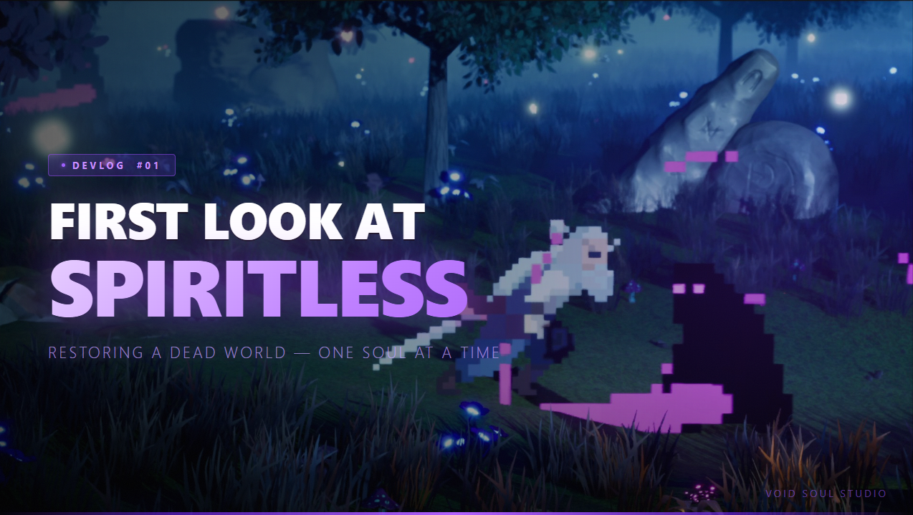
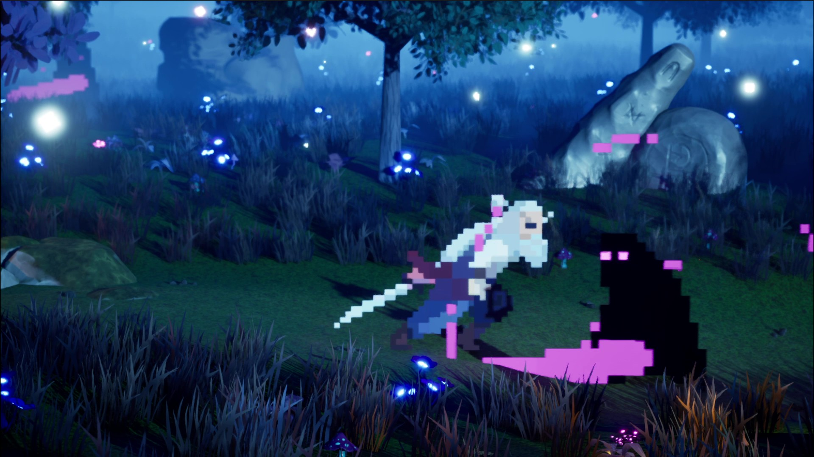
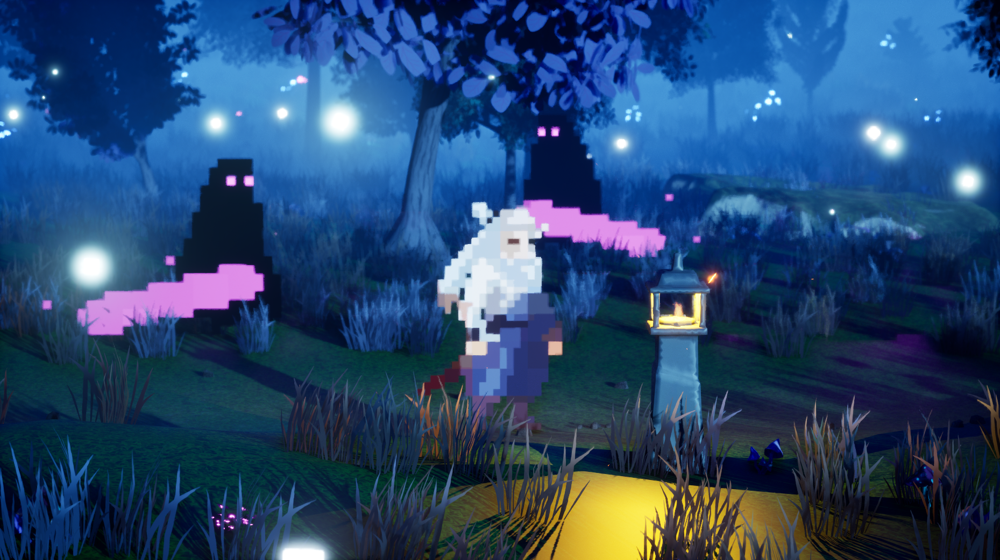
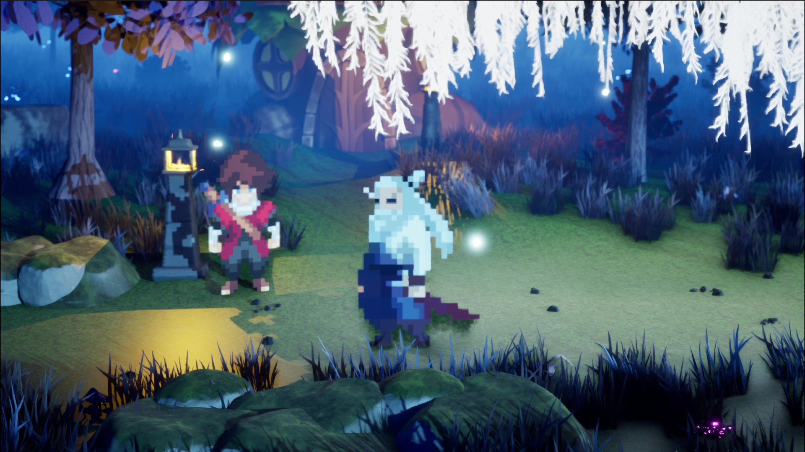
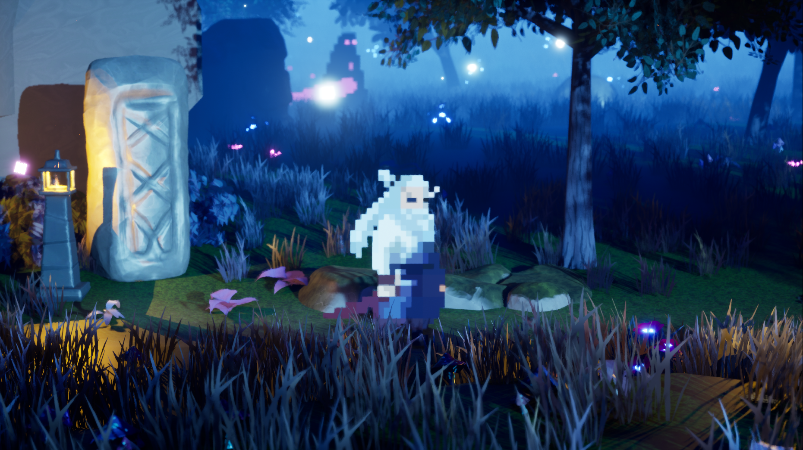

# Spiritless

> An in-development atmospheric action-adventure built in Unreal Engine 5, centered around environmental restoration as a core gameplay loop.

---

## Core Concept

Enemies have drained the forest of its life force, leaving the world in a monochrome, "spiritless" state. Players defeat enemies to collect lost souls and reinfuse them into the environment — gradually restoring colour, vitality, and life.

---

## Gameplay Loop

1. Explore a lifeless, black-and-white world
2. Engage and defeat corrupted enemies
3. Collect dropped souls/spirits
4. Deposit spirits back into the forest
5. Watch the world visually transform and regain colour

---

## Design Pillars

| Pillar | Description |
|---|---|
| **Visual Feedback Driven Gameplay** | Colour restoration reflects player impact |
| **Meaningful Combat** | Every enemy contributes to world healing |
| **Atmospheric Storytelling** | The environment tells the story without heavy exposition |
| **Progress Through Restoration** | Advancement is tied to reviving the world |

---

## Gameplay Video

---

## Screenshots

<table>
  <tr>
    <td></td>
    <td></td>
  </tr>
  <tr>
    <td></td>
    <td></td>
  </tr>
</table>

---

## System Requirements

| | Minimum | Recommended |
|---|---|---|
| **OS** | Windows 10 64-bit | Windows 11 64-bit |
| **Engine** | Unreal Engine 5.5 | Unreal Engine 5.7+ |
| **CPU** | Intel i5-8600 / AMD Ryzen 5 3600 | Intel i7-12700 / AMD Ryzen 7 5800X |
| **RAM** | 16 GB | 32 GB |
| **GPU** | NVIDIA GTX 1070 / AMD RX 5700 | NVIDIA RTX 3070 / AMD RX 6800 XT |
| **Storage** | 15 GB available | SSD recommended |

> This project is source-only. To open it you will need Unreal Engine 5.5 or later installed via the Epic Games Launcher.

---

## Current Focus

- Core combat systems
- Enemy behaviour
- UI/UX — rune-based health systems, spirit indicators
- Environmental visual transitions (monochrome → vibrant colour)

---

## Tech

- **Engine:** Unreal Engine 5
- **Architecture:** 2.5D — Paper ZD sprites on a 3D world
- **Input:** Enhanced Input System

---

> **Copyright © 2026 Kyron (Dev_Kyron). All Rights Reserved.**
> This repository is public for educational and portfolio purposes only. See [COPYRIGHT](COPYRIGHT) for full terms.
